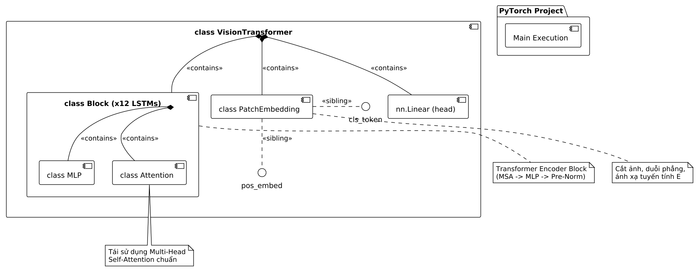
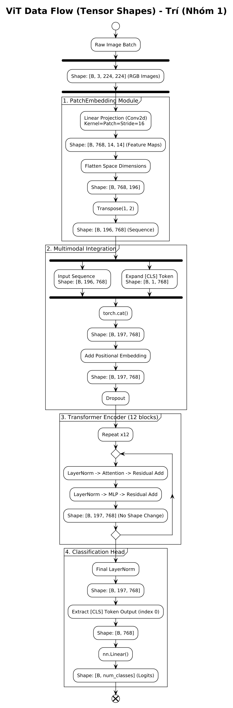

# 👁️ Vision Transformer (ViT-Base) From Scratch — PyTorch

Dự án triển khai cấu trúc mạng **Vision Transformer (ViT-Base)** hoàn toàn từ con số 0 (from scratch) bằng framework **PyTorch**, phục vụ cho bài toán Phân loại hình ảnh (Image Classification) trong khuôn khổ môn học Học sâu (Deep Learning) — Lab 5 (Nhóm 1).

---

## 1. Code của chúng ta có những gì?

Mã nguồn được tổ chức chuẩn hóa theo mô hình Modular OOP, phân rã thành các cấu trúc Class độc lập nằm trong file `src/image_classification/model.py` và bộ khung điều khiển chính `main_image.py`:

* **`PatchEmbedding`**: Cắt ảnh 2D (`[B, 3, 224, 224]`) thành chuỗi các mảnh phẳng (Patches) kích thước 16x16 thông qua lớp tích chập `nn.Conv2d`, sau đó duỗi phẳng thành chuỗi vector nhúng `[B, 196, 768]`.
* **`Attention`**: Triển khai cơ chế tự chú ý đa đầu tuần túy (Scaled Dot-Product Multi-Head Self-Attention). Gộp chung ma trận Query, Key, Value vào một lớp tuyến tính duy nhất để tối ưu hóa tốc độ tính toán song song.
* **`MLP`**: Mạng truyền thẳng gồm 2 tầng tuyến tính và hàm kích hoạt GELU, giữ vai trò trích xuất đặc trưng phi tuyến tính sâu sau lớp chú ý.
* **`Block`**: Khối Transformer Encoder hoàn chỉnh tích hợp cơ chế Pre-Norm (LayerNorm đặt trước) và kết nối tắt (Residual Connections) giúp loại bỏ hiện tượng biến mất gradient khi mô hình tăng độ sâu.
* **`VisionTransformer`**: Module tổng thể quản lý luồng dữ liệu. Lớp này thực hiện khởi tạo và chèn `[CLS] Token`, cộng ma trận vị trí không gian `Positional Embedding` học được, điều phối qua 12 lớp Block Encoder và kết nối với Classification Head cuối cùng để xuất ra Logits.
* **`main_image.py`**: Khung pipeline điều phối chính (Train Engine Skeleton) đặt tại thư mục gốc. Đã cấu hình sẵn trình quản lý phần cứng tự động (CUDA/CPU), khởi tạo AdamW Optimizer, CrossEntropy Loss và cấu trúc cấu trúc vòng lặp huấn luyện mẫu.

---

## 2. Kiến trúc và Luồng Biến đổi Dữ liệu (Architecture & Dataflow)

### Sơ đồ Kiến trúc Tổng quan (Model Architecture)
Sơ đồ phân lớp cấu trúc và mối quan hệ phân cấp giữa các module độc lập bên trong hệ thống:



### Sơ đồ Luồng dữ liệu và Biến đổi Ma trận (Data Flow)
Đặc tả chi tiết sự thay đổi kích thước hình học (Tensor Shapes) của dữ liệu từ ảnh thô đầu vào đến logits đầu ra:



### Bảng tổng hợp kích thước Tensor qua từng lớp (Dành cho Team Phân tích)

| Phân đoạn xử lý / Lớp mạng | Kích thước Tensor Đầu vào | Kích thước Tensor Đầu ra | Ý nghĩa toán học & Kỹ thuật |
| :--- | :--- | :--- | :--- |
| **Dữ liệu ảnh thô (Input Batch)** | N/A | `[B, 3, 224, 224]` | Lô dữ liệu gồm `B` ảnh màu RGB kích thước chuẩn 224x224. |
| **Patch Embedding (Conv2d)** | `[B, 3, 224, 224]` | `[B, 768, 14, 14]` | Trích xuất các đặc trưng cục bộ bằng nhân Conv kích thước 16x16. |
| **Duỗi thẳng (Flatten & Transpose)** | `[B, 768, 14, 14]` | `[B, 196, 768]` | Duỗi không gian không gian 2D thành chuỗi tuần tự $N = 196$ tokens. |
| **Gộp [CLS] Token (Concat)** | `[B, 196, 768]` ghép với `[B, 1, 768]` | `[B, 197, 768]` | Chèn thêm 1 token đặc biệt vào đầu chuỗi đại diện cho thông tin toàn cục. |
| **Cộng Sơ đồ Vị trí (Pos Embed)** | `[B, 197, 768]` | `[B, 197, 768]` | Cộng ma trận học vị trí không gian để giữ lại thông tin hình học của ảnh. |
| **Transformer Encoders (x12 Blocks)** | `[B, 197, 768]` | `[B, 197, 768]` | Xử lý tương tác chuỗi qua 12 tầng mạng MSA và MLP xếp chồng song song. |
| **Trích xuất Đặc trưng Phân loại** | `x[:, 0]` | `[B, 768]` | Chỉ tách riêng trạng thái đầu ra của lớp ẩn tại vị trí `[CLS] Token`. |
| **MLP Classification Head** | `[B, 768]` | `[B, num_classes]` | Chiếu tuyến tính về số lượng lớp đích để tính toán hàm Loss chéo. |

---

## 3. Người tiếp theo phải làm gì? (Hướng dẫn dành cho Tâm)

Mô hình cấu trúc ViT-Base đã hoàn thiện phần lõi kiến trúc và sẵn sàng nhận dữ liệu thực nghiệm phần cứng. Thành viên tiếp theo (Chí Tâm) cần thực hiện các bước sau để kết nối hệ thống:

1. **Hoàn thiện cấu trúc file `src/image_classification/dataset.py`**:
   * Viết logic tiền xử lý hình ảnh sử dụng `torchvision.transforms` để tải tập dữ liệu phân loại (Ví dụ: CIFAR-10).
   * Cấu hình kích thước ảnh bắt buộc phải sử dụng `transforms.Resize((224, 224))` và chuẩn hóa theo phân phối ImageNet để tương thích cấu trúc đầu vào của `PatchEmbedding`.
   * Thiết lập và trả về cấu trúc `train_loader`, `val_loader`.

2. **Hoàn thiện file `main_image.py` ngoài thư mục gốc**:
   * Tiến hành import module DataLoader vừa xử lý từ file `dataset.py` vào file main.
   * Di chuyển xuống khối hàm `train_model()`, gỡ bỏ ký tự chú thích (uncomment) tại vòng lặp huấn luyện: `for batch_idx, (images, labels) in enumerate(train_loader):`.
   * Triển khai mã nguồn tính toán hàm loss ngược (`loss.backward()`), cập nhật tối ưu hóa trọng số (`optimizer.step()`), đo đạc chỉ số Accuracy (%) kiểm thử sau mỗi Epoch và lưu lại log tiến trình.

3. **Khởi chạy thực nghiệm**:
   * Mở Terminal tại thư mục gốc của dự án (đảm bảo môi trường ảo `.venv` đã kích hoạt thành công nhân đồ họa CUDA) và thực thi lệnh:
   ```bash
   python main_image.py